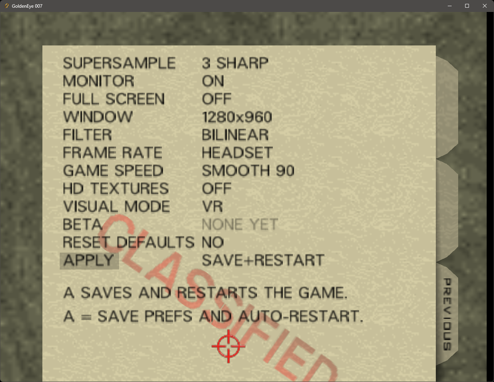

  

# GEVR

**GoldenEye. Native. In VR. Bring your own ROM.**

> **Play now:** GitHub **Latest** is **[vr452.4](https://github.com/no6969el/GEVR/releases/tag/vr452.4)** — zip [`GEVR-Beta-vr452.4-win64.zip`](https://github.com/no6969el/GEVR/releases/download/vr452.4/GEVR-Beta-vr452.4-win64.zip). Or hit **Update** in GevrRomStarter.

> This public repo is for **player docs**, **Issues**, and **Beta zip Releases**. New product code is developed privately. See [`docs/SOURCE.md`](docs/SOURCE.md).

---

The N64 classic you can finally *stand inside* — not an emulator overlay, not a flat game with a headset stuck on. GEVR is a from-source PC port of *GoldenEye 007* built for real OpenXR VR. You supply a **USA GoldenEye ROM you legally own**; the starter prepares a local cache and **`Start-GEVR.bat`** launches through **GevrRomStarter** (not bare `goldeneye.exe`).

| | |
|---|---|
| **Download** | [**GEVR-Beta-vr452.4-win64.zip**](https://github.com/no6969el/GEVR/releases/download/vr452.4/GEVR-Beta-vr452.4-win64.zip) |
| **Release page** | [vr452.4](https://github.com/no6969el/GEVR/releases/tag/vr452.4) |
| **Latest** | [Releases / Latest](https://github.com/no6969el/GEVR/releases/latest) |
| **Controls** | [docs/CONTROLS.md](docs/CONTROLS.md) |
| **Report a bug** | [New Issue](https://github.com/no6969el/GEVR/issues/new/choose) |
| **Discord** | [discord.gg/flat2vr](https://discord.gg/flat2vr) |
| **Features** | [FEATURES.md](FEATURES.md) |
| **Support** | [Patreon](https://www.patreon.com/cw/GEVR) |

Star the repo and [follow @no6969el](https://github.com/no6969el). **Watch → Releases** for ship pings.

---

## Install (vr452.4)

1. Download **[GEVR-Beta-vr452.4-win64.zip](https://github.com/no6969el/GEVR/releases/download/vr452.4/GEVR-Beta-vr452.4-win64.zip)** from [Latest](https://github.com/no6969el/GEVR/releases/latest) / [tag vr452.4](https://github.com/no6969el/GEVR/releases/tag/vr452.4). **No ROM inside the zip.**
2. Unzip anywhere.
3. Run **`Start-GEVR.bat`** — it sets VR boot knobs and starts **GevrRomStarter.exe**.
4. Point at your **USA GoldenEye `.z64`** when asked. Images extract to `%LOCALAPPDATA%\GEVR\cache\<ROM-hash>\`. Each Beta tag bumps a **ship stamp** so the first launch after an update rebuilds that cache once from your ROM.
5. Put the headset on. Recenter with **both thumbstick clicks**.
6. On the intro hub, **look right** for **GEVR Settings** and tune comfort. Enjoy.

**Please use the bat** — it locks in the good VR settings and runs the ROM starter we ship for this cut (not bare `goldeneye.exe`).

Default is **VR**. Flat / monitor: **`Play-on-monitor.bat`** — same game, no headset.

**New install:** first launch waits once while images prepare, then you play. Saves start empty.

**After an update:** keep the same USA `.z64`. The ship stamp forces **one** automatic re-prepare. **Saves and GEVR Settings are kept** under `%LOCALAPPDATA%\GEVR`. Or use **Update** in GevrRomStarter. For picture problems, try **`Clear-GEVR-cache.bat`** (type **YES**) before deleting the whole `%LOCALAPPDATA%\GEVR` folder.

---

## Controls (right after install)

**How to control GEVR in VR** — walkthrough on YouTube: **[watch here](https://www.youtube.com/watch?v=Jst5srE6Iwc)**

**Right = gun hand, left = walk hand + watch cuff.** Meta Quest / Touch, Valve Index, and Oculus-style OpenXR use the same actions (Index names in [`docs/CONTROLS.md`](docs/CONTROLS.md)).

### Movement & comfort

| Control | What it does |
|---|---|
| **Left stick** | Walk and strafe |
| **Right stick** | Turn (**Smooth** or **Snap** in **GEVR Settings**) |
| **Both thumbstick clicks** | Recenter playspace (`Home` on keyboard) |
| **Head / room-scale** | Look; walk your room to move in Bond-world |
| **Right stick up/down while aiming** | Stand / crouch |
| **Left stick while aiming** | Walk forward/back (no accidental duck) |

### Combat & weapons

| Control | What it does |
|---|---|
| **Right trigger** | Fire right-hand gun |
| **Left trigger** | Fire left-hand gun |
| **Grip / squeeze** | **Aim / ADS** on the gun ray |
| **Grip near a door** | Open / close |
| **Right B** (Index **B**) | **USE** — reload, switches, plant/activate, all retail **B** actions |
| **Right A** (Index **A**) | **Next weapon** (right hand) |
| **Left X** | **Previous weapon** (left hand) |
| **Left grip on fore-end** | **Two-hand hold** — stabilize rifles/shotguns/SMGs in the right hand |
| **Grip near ground weapon** | Pick up into **that** hand |
| **Grip on your own stuck mine** | Pick remote / arming prox mine back up |
| **Right grip at hip** | Holster gun / draw from hip (fist toggle) |
| **Trigger** | Throw grenades, fire launchers, etc. |

**Dual-wield:** one gun per hand; each trigger fires that hand. **Throwables** (grenades, mines, plastique, modem) show in-hand; **B** plants/activates where retail does.

### Bond’s watch (pause + cuff)

| Control | What it does |
|---|---|
| **Menu** (Quest left; Index system) | **Pause** — watch inventory (**Left Y** also pause in shipped profile) |
| **Pause watch → Watch Laser** | Cuff press = **laser only** |
| **Pause watch → Detonator** | Cuff press = **detonate remotes** if any planted, else **laser** |
| **Pause watch → Watch Magnet Attract** | Select, then **touch left cuff + right squeeze** = one **attract** pulse (ammo spent) |
| **Right grip on left watch face + squeeze** | **Cuff press** — laser, detonate, or magnet (per selection above) |

Magnet **repel** is still picked from the pause watch like retail (no cuff shortcut). Full watch and flat keyboard tables: [`docs/CONTROLS.md`](docs/CONTROLS.md).

---

## vr452.4 features (how to use them)

### GEVR Settings (in-game menu)

On the intro hub, **look right** at the **GEVR Settings** glass (GoldenEye-style folder UI). This is where picture, monitor, and profile options live — not the pause watch.

**How to use the menu:** **A** selects a row. Stick **left / right** changes that row’s value. **A** again accepts. Highlight **Apply** (Save+Restart) and press **A** to **save and restart** the game into your choices.

**Visual mode** is **VR**, **XR**, or **flat**. Each mode keeps its **own saved settings** — switch Visual mode to edit a different profile.

Default rows in vr452.4 (yours may differ after you change things):

| Row | Example value |
|---|---|
| Supersample | 3 Sharp |
| Monitor | On |
| Full screen | Off |
| Window | 1280×960 |
| Filter | Bilinear |
| Frame rate | Headset |
| Game speed | Smooth 90 |
| HD textures | Off |
| Visual mode | VR |
| Beta | None yet |
| Reset defaults | No |
| Apply | Save+Restart |

  

**Monitor** (while you play in VR or XR): choose **both eyes**, **left eye only**, **right eye only**, or **no desktop picture**. The row is **greyed out in flat** Visual mode. Monitor choice is saved with the **VR** and **XR** profiles, not the flat profile.

New features will keep being added to this menu. **Beta** will hold test options in the future — it shows **None yet** today.

### HD textures

**GEVR does not ship the pictures.** Download the community **GLideN64 PNG** zip (**not** the `.hts` file) from [GoldenEye-007-HD releases](https://github.com/GhostlyDark/GoldenEye-007-HD/releases) or the [GE007 HD texture pack page](https://evilgames.eu/texture-packs/ge007-hd.htm).

1. Extract the zip so the **`GOLDENEYE`** folder sits inside **`hdtextures`** next to `goldeneye.exe` (do not rename the picture files).
2. In **GEVR Settings**, set **HD textures** to **On**.
3. **Apply**, then play on the **next boot**.

### More vr452.4 highlights

| Feature | One-line how-to |
|---|---|
| **Saved settings** | Edit under **Visual mode** VR / XR / flat; **Apply** restarts into that profile. |
| **Rockets** | Rocket launcher stays on the gun; flat crosshair on the rocket path. |

Older comfort and combat passes still in this line: playspace / hands ([#74](https://github.com/no6969el/GEVR/issues/74)), melee swing ([#75](https://github.com/no6969el/GEVR/issues/75)), Janus spawn ([#82](https://github.com/no6969el/GEVR/issues/82)), Dam sky / grip doors ([#80](https://github.com/no6969el/GEVR/issues/80), [#90](https://github.com/no6969el/GEVR/issues/90)), cuff / dual-wield / watch magnet, and more — see [FEATURES.md](FEATURES.md).

---

## Older playtest (video)

This clip is from an **older public cut (~vr441)** — picture and controls may not match **vr452.4**.

[Watch on YouTube](https://www.youtube.com/watch?v=z4B0Ceqrf6I)

---

## What we tested

| Path | Notes |
|------|--------|
| **Pimax Crystal Super + SteamVR OpenXR** via [CustomHeadsetOpenVR](https://github.com/sboys3/CustomHeadsetOpenVR) (sboys3) | Primary wear path — we do not maintain that driver; we *do* support this experience |
| **Native PimaxXR** | Verified attach / play |
| **Meta Quest 3 + Virtual Desktop OpenXR (VDXR)** | Verified attach / play |
| **RTX 5060 laptop + Quest 3 + Virtual Desktop VDXR** | BarZ wear **vr441**, 2026-09-17; one data point, not a minimum spec |

**Half-speed / mushy VR?** Turn **SteamVR Motion Smoothing Off** and **Virtual Desktop Space Warp Off**. Details: [`docs/BETA.md`](docs/BETA.md#half-speed--mushy-vr).

When you report a bug or crash, please include: **headset**, **OpenXR runtime**, **SteamVR on/off**, **HMD vs monitor**, whether you used **`Start-GEVR.bat`**, your **`gevr-*-boot.cmd`** filename from the zip folder, any log next to the zip or in the console, and any **`gevr-fault-*.txt`** beside the exe. Do **not** upload your ROM.

---

## Discord (help + fan chat)

**[Join the GEVR Discord](https://discord.gg/flat2vr)** for port help and GoldenEye fan chat. BYO ROM — do not upload your ROM (setup details and logs only). GitHub Issues stay great for tracked bugs.

---

## Known quirks (honest Beta)

- **Half-speed / mushy VR:** SteamVR **Motion Smoothing Off**; VD **Space Warp Off** ([BETA.md](docs/BETA.md#half-speed--mushy-vr)).
- **Frigate door / aperture** ([#79](https://github.com/no6969el/GEVR/issues/79)) and other level stoppers — ongoing focus.
- **Prop-on-prop / Dam blue** ([#70](https://github.com/no6969el/GEVR/issues/70)) and remaining Dam / Frigate water look issues.
- **Melee / fist** is in (swing-based) but not finely tuned ([#75](https://github.com/no6969el/GEVR/issues/75)).
- **Big explosions** can still hard-crash — grab `gevr-fault-*.txt` beside the exe before relaunch.
- Empty hand draws a **cube** (hides when that hand holds a weapon).
- Expect occasional **crashes** while we keep polishing.

More tester notes: [BETA.md](docs/BETA.md) · [CONTROLS.md](docs/CONTROLS.md).

---

## Why this exists

- **Native / from-source** — full ownership of the game loop for proper VR
- **OpenXR** — Crystal, Quest via PC, SteamVR-class HMDs
- **Your ROM** — legal ownership stays with you
- **Feel first** — 6DOF, aiming, presence; then polish; then extras

More pitch: [FEATURES.md](FEATURES.md). Credits: [CREDITS.md](CREDITS.md). Boundaries: [PRIOR-ART.md](PRIOR-ART.md), [LICENSE](LICENSE). Other projects using GEVR: [docs/OTHER-PROJECTS.md](docs/OTHER-PROJECTS.md).

---

## Docs (player)

- Start: [`docs/00-START-HERE.md`](docs/00-START-HERE.md)
- Controls: [`docs/CONTROLS.md`](docs/CONTROLS.md)
- Beta snapshot: [`docs/BETA.md`](docs/BETA.md) · [`docs/FEATURES-CURRENT.md`](docs/FEATURES-CURRENT.md)
- Other projects: [`docs/OTHER-PROJECTS.md`](docs/OTHER-PROJECTS.md)

Jump in and enjoy finally being Bond in GoldenEye VR.
